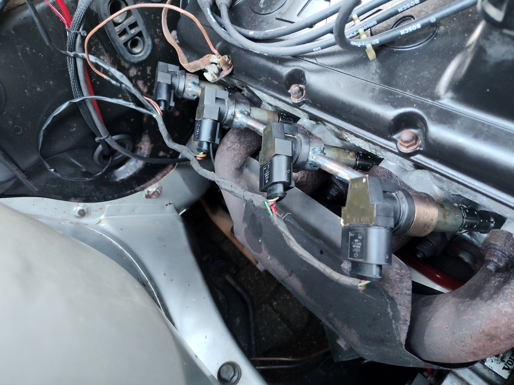
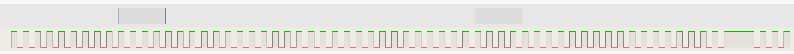
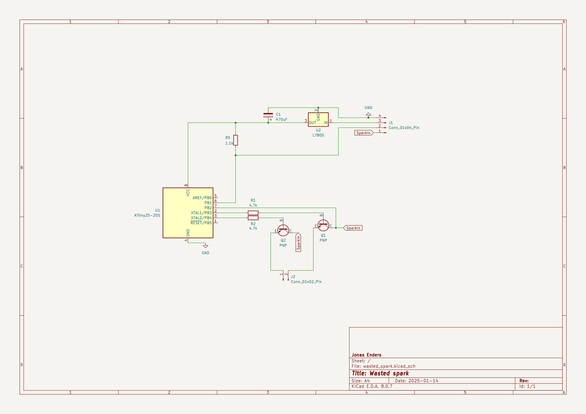
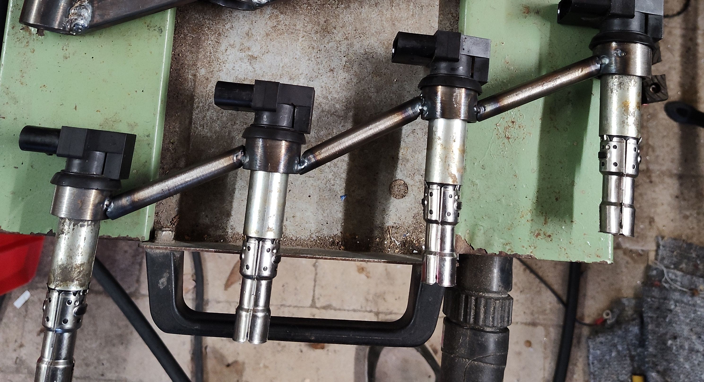

# Wasted spark convertion of a Volvo 240 LH 2.4

I converted my Volvo 240 to coil on plug (NGK 48003)

The EZK (Bosch 0 227 400 169) already receives data from crankshaft sensor and spark signal in this form:

Crankshaft position sensor uses a 60-2 teeth trigger wheel.

I used a Attiny25 to analyse the crank signal and split the spark signal into separate signals for cylinders 1+4 and cylinders 2+3.

The white cable on the right is the spark signal, the brown on the left the crank signal. White cable on the left GND, red +12v (15).

I made a custom bracket for the coils:

